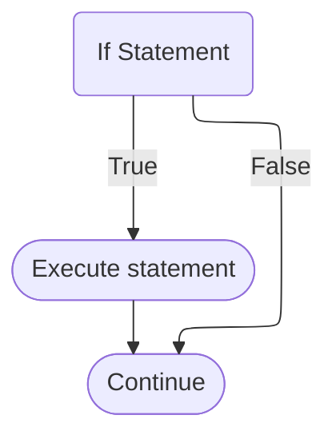
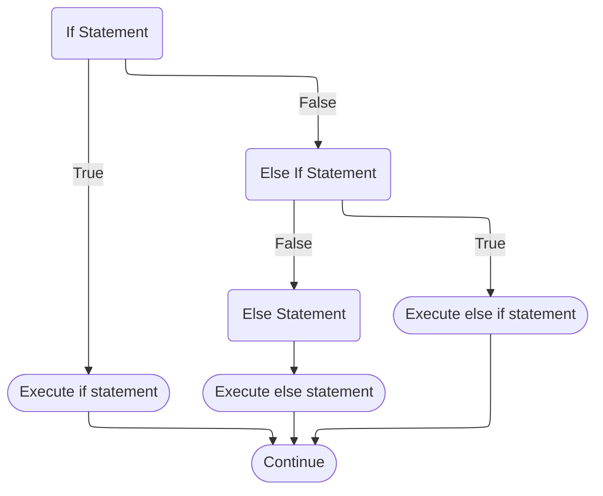
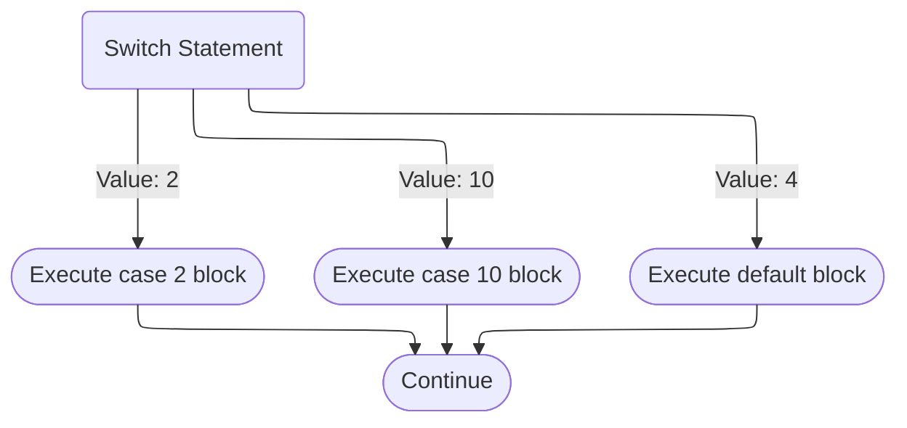

import TextTooltip from '@site/src/components/text/textTooltip/textTooltip';

# Control Flow

Control flow in Java refers to the order that the code executes. The control flow of a Java
program can be controlled using conditional statements and loops. Before we get into too much
detail in terms of control-flow statements, we first will want to discuss <TextTooltip text="scopes"/>.

## Scopes

A scope is defined as the region of code where a variable exists and can be accessed.
In Java, each set of curly braces `{}` defines a new scope.
There are three main types: Block scopes, Class scopes and method scopes.
In this page we will mainly be focusing on block scopes.

```java
{ // <--- Start scope

    DoSomething();

} // <--- End scope
```

### Block Scopes

When it comes to conditional statements, they use what are referred to as block scopes.
Variables declared within a block are only accessible within that block and are "out of scope" once the control flow exits that block.

Here's an example of block scopes using an if statement:

```java
if (true) {
    int a = 10; // a is only accessible within this if statement
    System.out.println(a); // This will print 10 to the console
}

// This will throw an error, a cannot be resolved as we are "out of scope" for where it was declared.
// Error
System.out.println(x);
```

## Conditional Statements

Conditional statements allow methods to execute code based on certain conditions.
The primary conditional statements in Java are: `if`, `else if`, `else`, and `switch`.

### If Statements

The `if` statement executes a block of code, or an expression if a given condition is true.

```java
// Expression
if (a > 5) System.out.println("a is greater than 5");

// Block
if (a > 5) { // <--- Start block scope
    System.out.println("a is greater than 5");
} // <--- End block scope
```



### Else If and Else Statements

The `else if` statement is used in conjunction with an `if` statement and specifies a new condition if the condition in the `if` statement is false.
The `else` statement executes a block of code, or expression if all conditions are false.

```java
// Expression
if (a > 5) System.out.println("a is greater than 5");
else if (a < 5) System.out.println("a is less than 5");
else System.out.println("a is 5");

// Block
if (a > 5) {
    System.out.println("a is greater than 5");
}
else if (a < 5) {
    System.out.println("a is less than 5");
}
else {
    System.out.println("a is 5");
}
```



### Switch Statements

// Talk about switch expressions
// Talk about fall through without breaks for both expressions and statements

The `switch` statement selects one of many code blocks to be executed, based on the value of a variable or a given expression.
In Java, these can work with many different types: `byte`, `short`, `int`, `char`, `enum`, and `String`.

A `switch` statement will select a case block to execute by comparing the switch expression against the `case` values.
If the expression or variables value is not defined in a `case` then the `default` block will be executed.
The `break` keyword exits the switch statement, without this it would continue on to the next `case` block.

```java
int a = 2;

// In this example, the case 2 block will be exectuted as a == 2
switch (a) {
    case 2:
        System.out.println("a is 2");
        break;
    case 10:
        System.out.println("a is 10");
        break;
    default:
        System.out.println("a is not handled");
}

// In this example, both the case 2 and 10 block will execute as there is no break in case 2
switch (a) {
    case 2:
        // Bug here, missing break so we will also print "a is 10"
        // Warning
        System.out.println("a is 2");
    case 10:
        System.out.println("a is 10");
        break;
    default:
        System.out.println("a is not handled");
}
```



## Loops

Loops make it possible to repeatedly execute an expression or block of code based on conditional statements and conditional expressions.
The primary loops in Java are: `for`, `while`, and `do-while`.

### For Loop


## While Loop


## Do-While Loop


