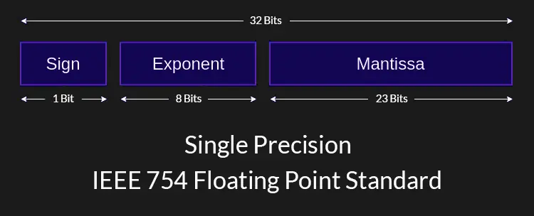

import TextTooltip from '@site/src/components/text/textTooltip/textTooltip';

# Primitive Types

Java is a typed language, and data types play a fundamental role, serving as blueprints for variables and defining the type of data that can be stored and
manipulated for a given <TextTooltip text="variable"/>. Understanding data types is essential for creating functionality in code for any given
task.

Variables must have a declared type for them to be interpreted correctly, unlike simpler programming languages that will automatically detect
this based off what is actively being stored in them. There are many different data types in Java, the most basic types are known as primitive types, they represent
single values and are directly supported as part of the language.

Other types such as Java Objects which is are instances of a given <TextTooltip text="Class"/>. Objects enable the implementation of concepts like <TextTooltip text="Abstraction"/>,
<TextTooltip text="Inheritance"/>, and <TextTooltip text="Polymorphism"/>, which we will explore in more detail in the Object Orientation Page.
<!-- TODO: Add link when no longer a draft. [Object Orientation Page](/docs/java-object-orientation) -->

:::note

This page outlines what primitive types are, in later pages based on variables, operators, and control flow we will discuss in more detail how these types can be used.

:::

In total there are 8 primitive types in Java:

- `boolean`
- `char`
- `byte`
- `short`
- `int`
- `long`
- `float`
- `double`

## Bits

An important thing to understand before moving on to the explanations of primitive data types are bits. Think of a bit as the smallest unit of information in a computer.
It's like a tiny switch that can be either "off" or "on", but in computers they are interpreted as binary, so '0' or '1'.

Now, when we group bits together, we can represent more complex information. For example, with just one bit, we can represent two possible values (0 or 1).
But if we have two bits, we can represent four possible values (00, 01, 10, 11). This scales exponentially as we add more bits to represent a given value or in this case data type.

In computer memory and data storage, information is stored using combinations of bits. For example, text, images, and videos are all stored as patterns of bits.
This is also the case for for computation, the way computers perform calculations, make decisions, and execute instructions is
done by manipulating bits in various ways.

## Boolean

The boolean type can have one of two values, `true` and `false`. It is used for evaluating logical conditions, and is typically used
for comparisons or in control flow statements, such as if statements, while loops, for loops etc. all of which we will later go over in the Control Flow Page.
<!-- TODO: Add link when no longer a draft. [Control Flow Page](/docs/java-control-flow) -->

When a variable makes use of the boolean type, you would initialize it by setting it to true or false.
If you choose not to initialize the default value, it will automatically be assigned a false value. 

```java
boolean bThisIsTrue = true;      // Initialized with the value true
boolean bThisIsFalse = false;    // Initialized with the value false
boolean bNotInitialized;         // Non-initialized so the values default is false
```

`Typically stored using 1 bit but this is not explicitly defined in Java`

## Char

The char type represents a single 16-bit Unicode character. It is mostly used to store individual characters, such as letters, digits, and symbols.
Although these days there are now some Unicode characters that require two or more char values. This type serves as a fundamental type for working with textual
data in Java, enabling you to manipulate individual characters and process text effectively.

When a variable makes use of the char type, you would initialize it by setting it via a character, number, symbol or hexadecimal value.
If you choose not to initialize the default value, it will automatically be assigned a null character value.

```java
char firstLetter = 'A';     // Initialized with the character 'A'
char digit = '3';           // Initialized with the character '3'
char symbol = '£';          // Initialized with the character '£'
char newLine = '\n';        // Initialized with the newline character
char bNotInitialized;       // Non-initialized so the values default is '\u0000' (Null character)
```

A Unicode character is a standardized character encoding system that assigns a unique numeric value (code point) to every character used in written languages around the world.
It aims to provide a universal character set that can represent text in any language. In Java, you can also initialize a variable of type char via hexadecimal values like so.

```java
char firstLetter = '\u0041';   // Initialized with the character 'A'
char digit = '\u0033';         // Initialized with the character '3'
char symbol = '\u00A3';        // Initialized with the character '£'
char newLine = '\u000A';       // Initialized with the newline character
char nullChar = '\u0000';      // Initialized with the null character
```

`Occupies 16 bits`

## Byte

The byte type represents an 8-bit <TextTooltip text="signed"/> integer. It can hold integer values ranging from -128 to 127. These types are most commonly used when memory
conservation is required, dealing with raw binary data, or when there is a very small range of values expected.

If you choose not to initialize a byte variable, it will automatically be assigned a default value of 0.
If you choose to initialize a byte variable outside the types range, will result in a compilation error.

```java
byte smallNumber = 42;         // Initialized with the value 42
byte negativeNumber = -100;    // Initialized with the value -100
byte defaultValue;             // Non-initialized so the values default is 0
byte errorValue = 1000;        // Value is outside of the types range, would result in a compilation error
```

`Stored using 8 bits`

## Short

The short type represents a 16-bit <TextTooltip text="signed"/> integer. It can hold integer values ranging from -32,768 to 32,767. These types are commonly used when memory
conservation is required or when dealing with data that falls within a moderate range of values.

If you choose not to initialize a short variable, it will automatically be assigned a default value of 0.
Attempting to initialize a short variable outside of the types range, will result in a compilation error.

```java
short smallNumber = 5000;         // Initialized with the value 5000
short negativeNumber = -20000;    // Initialized with the value -20000
short defaultValue;               // Non-initialized so the values default is 0
short errorValue = 123456;        // Value is outside of the types range, would result in a compilation error
```

`Stored using 16 bits`

## Int

The int type represents a 32-bit <TextTooltip text="signed"/> integer. It can hold integer values ranging from -2,147,483,648 to 2,147,483,647.
These types are commonly used for general-purpose integer-based calculations and when dealing with data that requires a wider range of values.

If you choose not to initialize an int variable, it will automatically be assigned a default value of 0.
Attempting to initialize an int variable outside of the types range, will result in a compilation error.

```java
int smallNumber = 5;              // Initialized with the value 5
int negativeNumber = -2000000;    // Initialized with the value -2000000
int defaultValue;                 // Non-initialized so the values default is 0
int errorValue = 123456789;       // Value is outside of the types range, would result in a compilation error
```

`Stored using 32 bits`

## Long

The long type represents a 64-bit <TextTooltip text="signed"/> integer.
It can hold integer values ranging from -9,223,372,036,854,775,808 to 9,223,372,036,854,775,807.
These types are commonly used when dealing with very large integer values or when a wider range of values is required compared to int.

If you choose not to initialize a long variable, it will automatically be assigned a default value of 0. 
Attempting to initialize a long variable outside of the types range, will result in a compilation error.

```java
long smallNumber = 100;           // Initialized with the value 100
long negativeNumber = -1250000;   // Initialized with the value -1250000
long defaultValue;                // Non-initialized so the values default is 0
long errorValue = 10000000000000000000000;   // Value is outside of the types range, would result in a compilation error
```

`Stored using 64 bits`

## Float

The float type represents a single-precision 32-bit floating-point number. It can hold decimal values with a precision of 7 digits.
These types are commonly used when dealing with decimal numbers that do not require high levels of precision, such as scientific calculations or representing fractional values,
so for calculations in games that are usually approximated, they are widely used.

To expand on what a float type is, take the number -1.2651111. We can split this up to the following:

- 1 bit is used to represent the sign `-`
- 8 bits for the Exponent `1`
- 23 bits for the Mantissa `2651111`



:::note

This is a simplified explanation. If you're interested in learning more on this topic. Look into IEEE Standard 754 Floating Point Numbers.

:::

A float has limited precision and can only represent a certain number of decimal places.
As the Exponent increases, so do the bits required to represent the value.

Take the value 12557.2651111, the Exponent has exceeded the 8 bits it originally had to represent its value. To store it, the number of bits representing
the Mantissa (decimal value) will need to reduce, therefore reducing its precision. In this case, it will be rounded to fit this new precision.
So storing 12557.2651111 would result in a float value of `12557.265f`.

```java
float smallNumber = 3.14f;          // Initialized with the value 3.1400000
float negativeNumber = -123.45f;    // Initialized with the value -123.4500000
float defaultValue;                 // Non-initialized so the values default is 0.0
float errorValue = 1111111111111.1111111111111f;   // Value is outside of the types range, would result in a compilation error
```

`Stored using 32 bits`

## Double

The double type represents a double-precision 64-bit floating-point number. It can hold decimal values with a precision of approximately 15-16 digits.
These types are commonly used when dealing with decimal numbers that require higher levels of precision, such as financial calculations, scientific computations,
or representing large or small quantities with high accuracy.

To expand on what a double type is, let's consider the number -1.26511111212331. We can split this up as follows:

- 1 bit is used to represent the sign `-`
- 11 bits for the Exponent `1`
- 52 bits for the Mantissa `-`

Much like the float, as the Exponent grows in size the decimal places become less precise. I won't go in to much more detail than this,
the concept is the same as the float but instead of single precision we have double precision allowing larger values in both the
Exponent and Mantissa.

```java
double smallNumber = 3.14f;          // Initialized with the value 3.1400000
double negativeNumber = -123.45f;    // Initialized with the value -123.4500000
double defaultValue;                 // Non-initialized so the values default is 0.0
```

`Stored using 64 bits`