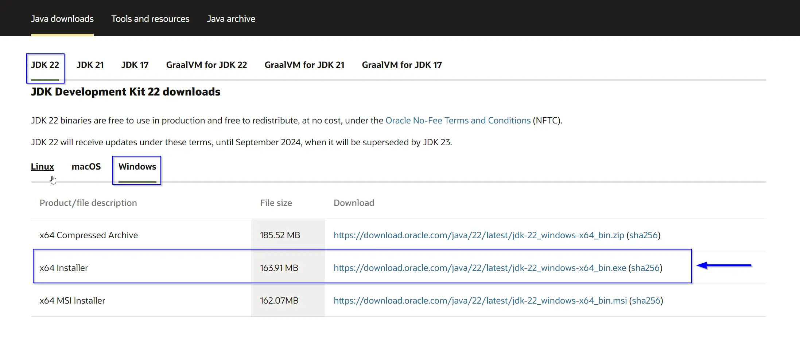
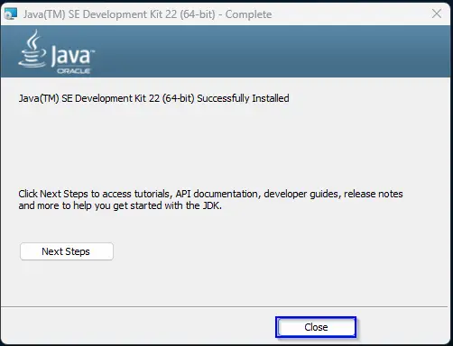
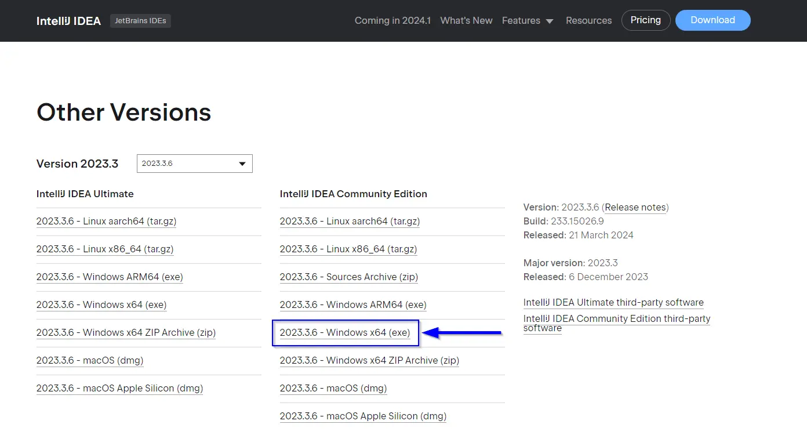
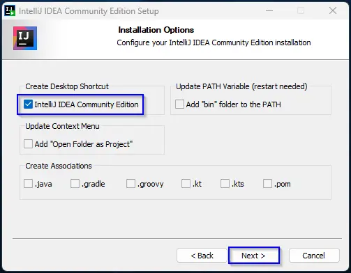
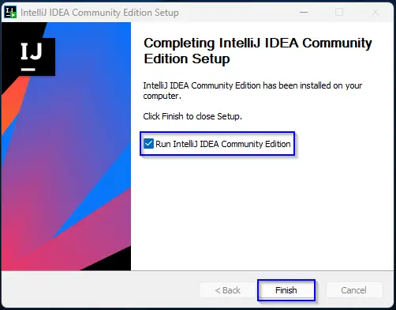

import TextTooltip from '@site/src/components/text/textTooltip/textTooltip';

# Introduction

Java is a versatile and widely used programming language, known for its simplicity for beginners.
Developed by James Gosling at Sun Microsystems in the mid 1990s, it was designed with the aim of creating a language that could run on any device,
regardless of the operating system.

It is one of the most popular programming languages in the world,
with usage spanning from enterprise software to mobile apps and games.
There is of course, much better solutions for game development like Unreal Engine using <TextTooltip text="C++"/> or Unity with <TextTooltip text="C#"/> but for learning purposes,
we will be using Java as a spring board to more modern and industry standard languages.

## Aim

The aim is to guide you from a beginner to an intermediate level of proficiency in programming, specifically with Java.
For beginners this module is a crucial foundation for your game development endeavors. Along the way, you'll grasp core programming concepts and gain a solid understanding
that will prepare you for more advanced topics in future modules.

## Getting Started

We will be getting started with Java by setting up an environment for you to learn practically. For our Java programming journey, we'll be using JetBrains IntelliJ IDEA as our <TextTooltip text="IDE"/> of choice.
It offers a wide range of features tailored to Java programming, including intelligent <TextTooltip text="code completion"/>,
By using IntelliJ IDEA, you'll have access to a robust set of tools that will enhance your learning experience
and help you become more proficient in Java.

We'll start our learning journey with a simple <TextTooltip text="hello-world"/> project, which is a traditional way to begin learning any programming language.
This project will help you become familiar with the basic syntax of Java, setting up a project in IntelliJ IDEA, and run your first Java program.

From there, we'll gradually progress to more advanced topics, such as classes, variables, methods, and object-oriented programming principles eventually evolving it
into a basic 2D game engine.

## Environment Setup

Before we dive in, this is the best time to set up your working environment. To get started we need to install the Java JDK and JetBrains IntelliJ IDEA.
Providing you with the tools to begin the hello-world section of this module.

:::note

The following environment setup is for Windows. If you are on MacOS or Linux you will need to find an alternate guide.

:::

### Java JDK

The Java Development Kit (JDK) is a set of tools and utilities provided by Oracle, for developing Java applications.

These tools and utilities include the following important components for the IDE to leverage:

:::note

Do not worry about understanding these components, they are later explained during practical usage.

:::

- Compiler
    - This is responsible for translating java source code files into byte code that can be executed by the <TextTooltip text="JVM"/>.
- Java Runtime Environment (JRE)
    - The JRE includes the <TextTooltip text="JVM"/>, <TextTooltip text="API"/>, and other components required to execute Java programs.
- Java Development Tools
    - This includes a debugger, archiving tool, documentation generation and more!

### IntelliJ IDEA

IntelliJ IDEA is an Integrated Development Environment (IDE) provided by JetBrains for developing Java applications.

This IDE offers a range of essential tools and utilities for software development, including:

:::note

Do not worry about understanding these features, they are later explained during practical usage.

:::

- Code Editor
    - This is where you will write and edit your Java code.
- Integrated Debugger
    - Allows you to identify and fix errors in your code by stepping through it line by line and inspecting variables.
- Source Control Integration
    - Enables seamless integration with source control systems like <TextTooltip text="Git"/>.
- Build Tools
    - Provides tools for building, running, and testing your Java applications directly within the IDE.
- Code Navigation
    - Helps you navigate through large codebases easily.
- Plugin Ecosystem
    - Allows you to extend the functionality of IntelliJ IDEA by installing plugins for additional features.

### Install Java JDK

To install Java JDK, navigate to the following link and download [JDK](https://www.oracle.com/uk/java/technologies/downloads/).

You should have a file named <code>jdk-22_windows-x64_bin.exe</code> or similar.

Open this file and allow it to open (you will need administrator privileges to install it).

Proceed to click next then install. If the installation was successful you will be met by this window.

### Install IntelliJ IDEA

To install JetBrains IntelliJ IDEA, navigate to the following link and download [IntelliJ IDEA](https://www.jetbrains.com/idea/download/other.html).

You should have a file named <code>ideaIC-2023.3.6.exe</code> or similar due to version changes.

Open this file and allow it to open (you will need administrator privileges to install it).

Proceed to click next until you are met with the following screen. I advise you to create a desktop shortcut but this is a personal preference.

Finally, press next then install. It will take some time to extract.

Once finished you will be met with this screen. Check "Run IntelliJ IDEA Community Edition" and then select Finish.

When IntelliJ IDEA opens, it may ask you to import settings. Unless you have an existing installation, you do not want to import any settings.
It may also ask to to allow some permissions when opening, allow these as they are important for the software to function correctly.

## Conclusion

By installing the Java Development Kit (JDK) and JetBrains IntelliJ IDEA, you now have all the necessary tools and resources to support your Java programming endeavors.
You're now ready to dive into setting up the <TextTooltip text="hello-world"/> project in the upcoming section.