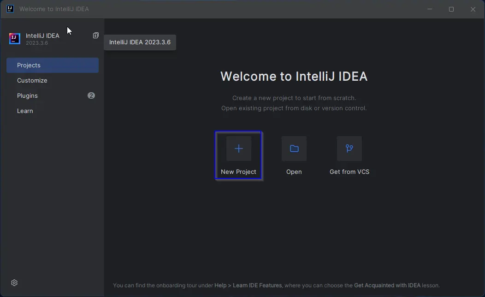
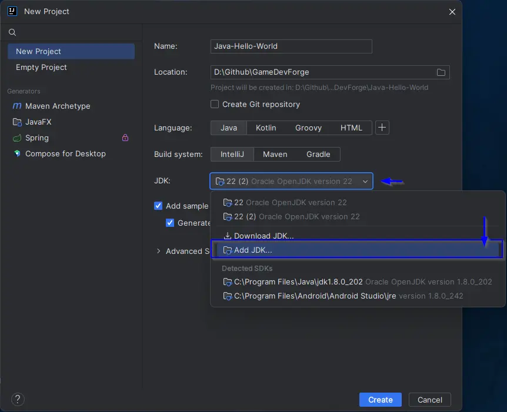
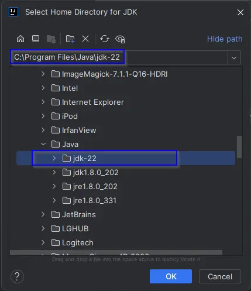
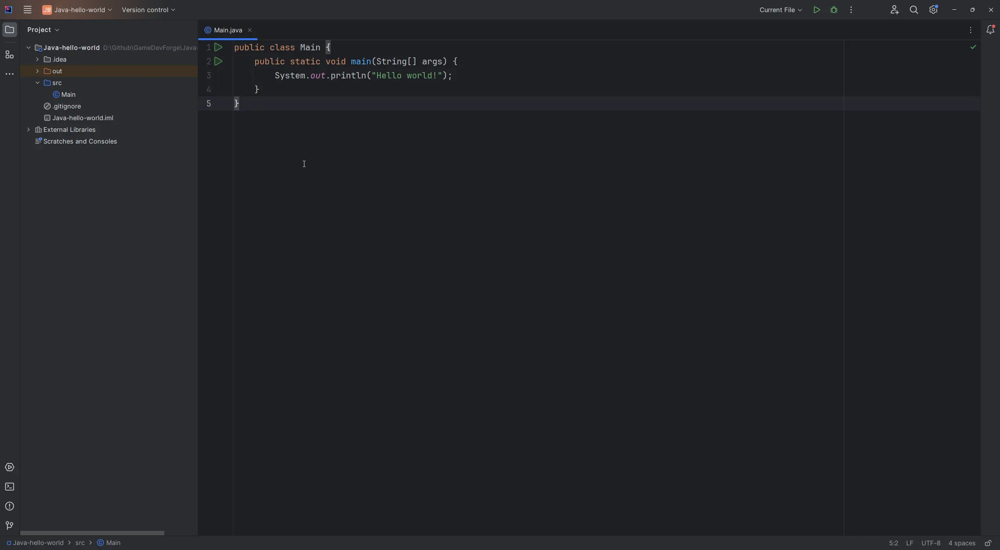
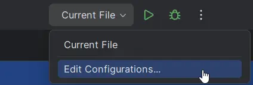
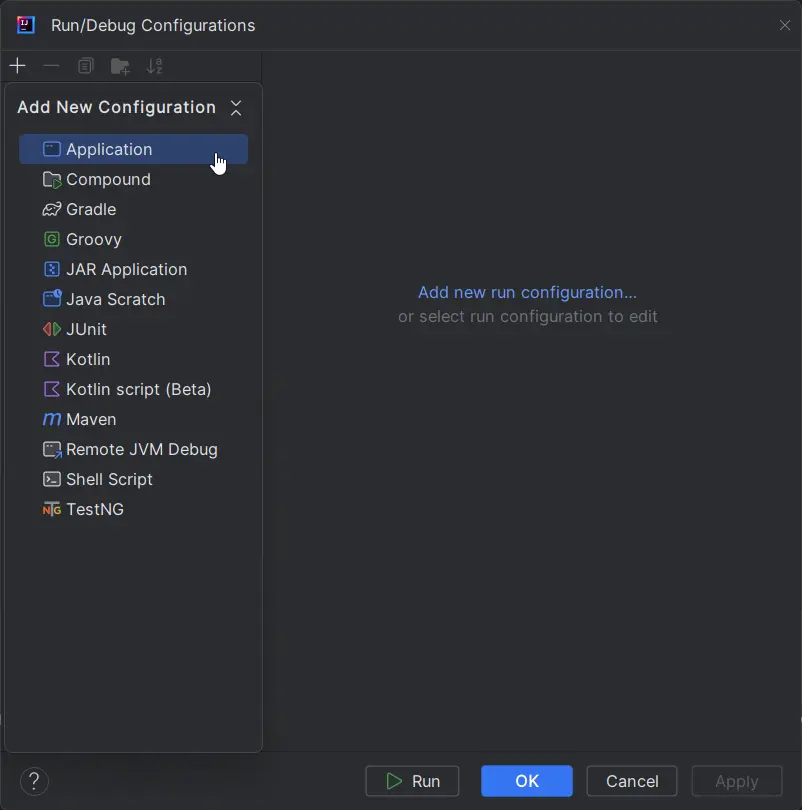
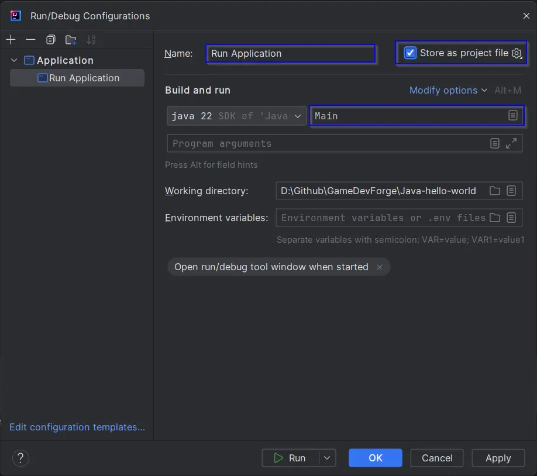
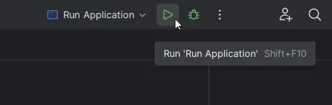
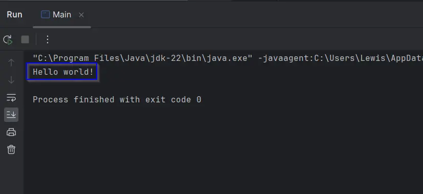
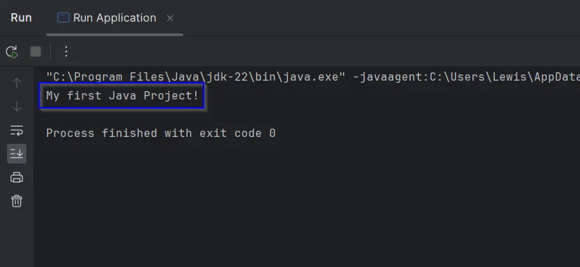

import TextTooltip from '@site/src/components/text/textTooltip/textTooltip';

# Hello World!

A "Hello World!" project is a simple program that displays the text "Hello World!" on a screen or <TextTooltip text="console"/>.
It is often the first program beginners write when learning a new programming language or environment because it introduces the basic
syntax and structure of the language without overwhelming complexity.

This is a gentle introduction to writing code, compiling, and running the program to see the output.
Additionally, it provides immediate feedback, helping us to confirm that you're working environment is set up correctly.

## Creating the Project

In the last section we set up your working environment. At this point I'm going to assume you have both a Java JDK and JetBrains IntelliJ IDEA installed.
To get started with creating a project, open the IntelliJ IDEA IDE. You should be presented with this window.



Moving forward, you will want to create a folder somewhere to keep your projects.
I suggest for now creating a folder named GameDevForge under your Documents folder and selecting this as the Location for the hello-world project.

- `Name`: Java-Hello-World - (The name of your project)
- `Location`: C:\Users\YOUR_USER_NAME\Documents
- `Language`: Java
- `JDK`: Oracle OpenJDK version 22

If you do not have Oracle OpenJDK version 22 as an option, you may need to add it shown below.




Once these are filled out, make sure to uncheck `Generate Code with onboarding tips` and then press Create. The new project should open in IDEA as seen below.



## Testing the Project

In the IDEA IDE, along the top of the window you should see a green play button, this will attempt to execute the main method in the currently open Java file.
This is fine for running our `Main.java` file and printing "Hello World!" to the console, but it can be confusing when working across multiple files without understanding
what an application's entry point is.

### What is an Entry Point?

An application's entry point is the part of the code where the program begins execution.
It is typically a specific method that is called when the program starts running.
In the context of a simple Java "Hello World!" program, the application's entry point is the `Main` method.

```java
// Main.java
public class Main {
    public static void main(String[] args) {
        System.out.println("Hello world!");
    }
}
```

In this Java program:

- The Main class contains a method named main.
- The main method has a parameter of type String[] args, which allows the program to accept command-line arguments.
- When the program is executed, the main method serves as the starting point for the program's execution.
- The `System.out.println` statement is used to print "Hello World!" to the console.

### Run/Debug Configuration

These settings define how your application should be executed or debugged.
They allow you to customize various aspects of the running or debugging process, You can create multiple configurations for different scenarios or testing environments.
This includes the main class to run, <TextTooltip text="program arguments"/>, <TextTooltip text="JVM"/> options, <TextTooltip text="environment variables"/>, and more.

The default run/debug configuration in your IDEA project should be `Current File`. As we continue we will be creating multiple Java files making it a pain to use.
So we are going to create a new run/debug configuration that will always run the Entry point in the `Main.java` file. Follow the steps below to set this up.

Along the top of the IDEA window, select the active configuration drop-down (If not yet changes it will read `Current File`).\
Select `Edit Configurations...`



In the top left select the + button to add a new configuration.



Give this configuration a name, in this case, we are setting up a run/debug configuration for running our main entry point in the `Main.java` file.
I have named it `Run Application` as it indicates what this configuration is for. Make sure to check `Store as project file`,
to store our new configuration as a file, if we later use source control it can be tracked and backed up this way. Finally, under the Build and Run section you will need to enter
`Main` as this is the file we wish to build and run in this configuration.

Select OK to create the config.



### Running the Application

The newly created `Run Application` configuration as default from the drop-down menu.\
Let's give it a test by pressing the green play button.



The `Run Application` configuration should have executed the Main entry point,
opened a console window along the bottom of the IDE, and printed "Hello World!".



Changing the input to `System.out.println` to anything else, for example I will change it to `My first Java Project!`, and running the application again will now print the new message.



## Conclusion

We have set up a Java working environment using JetBrains IntelliJ IDEA, creating a <TextTooltip text="hello-world"/> project.
You should now also understand the concept of an entry point in Java applications and the purpose of configuring custom run/debug settings.

Now we have a working environment, project, and an understanding of how to run and test code, we are ready to continue to the core concepts
of Java development in the upcoming sections.